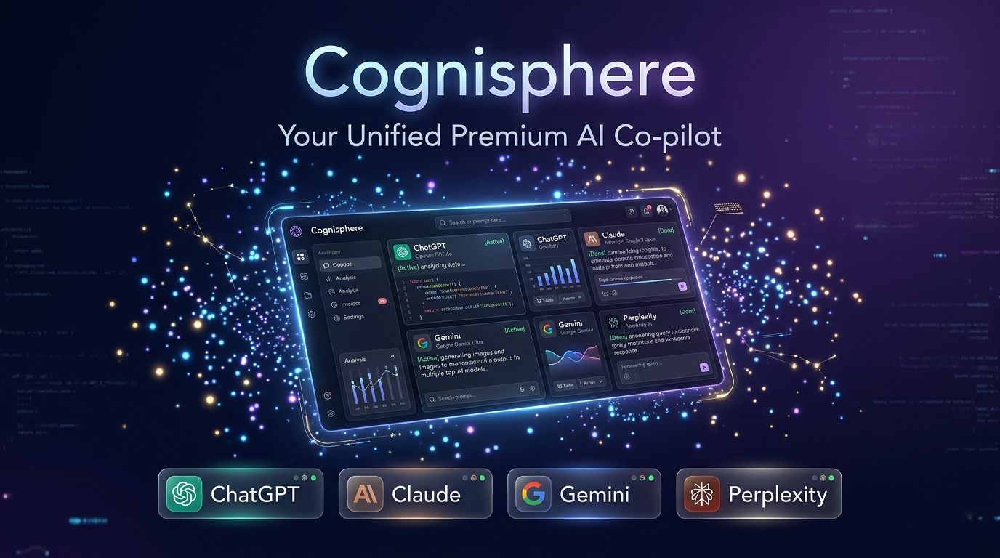
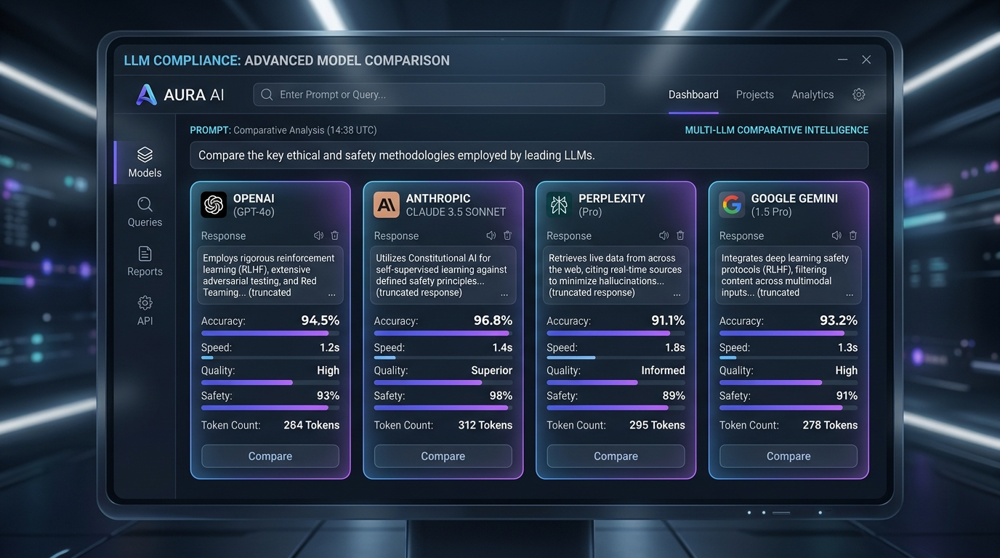
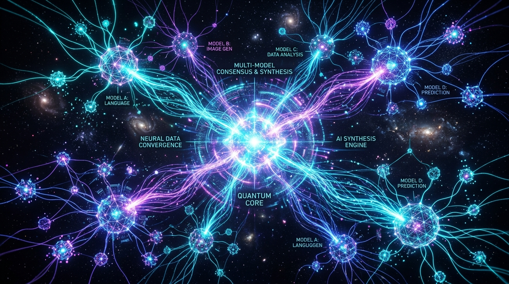
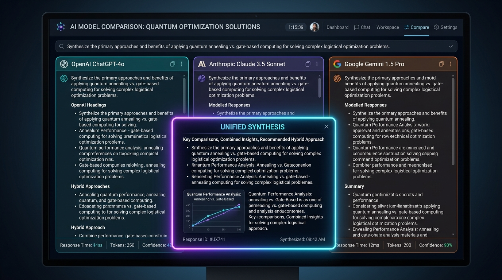
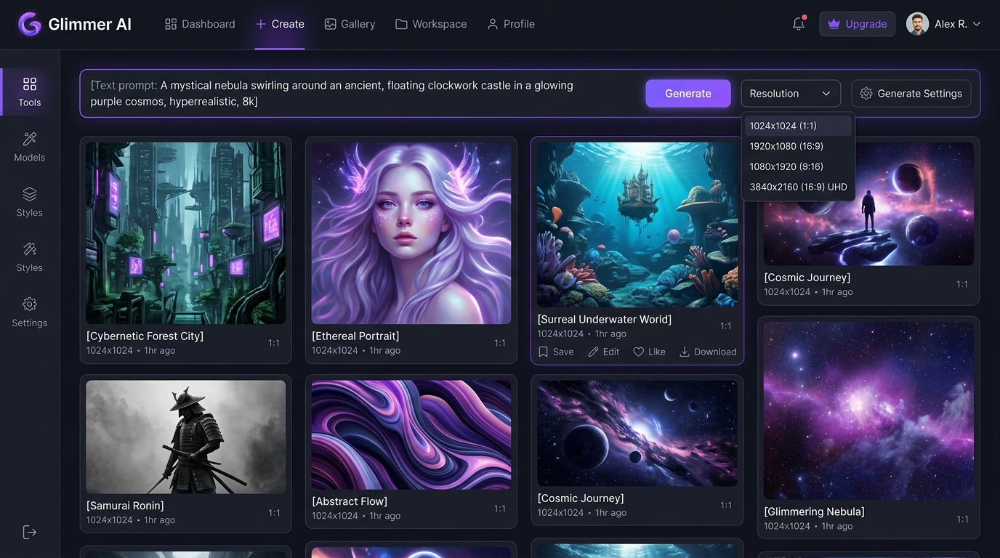
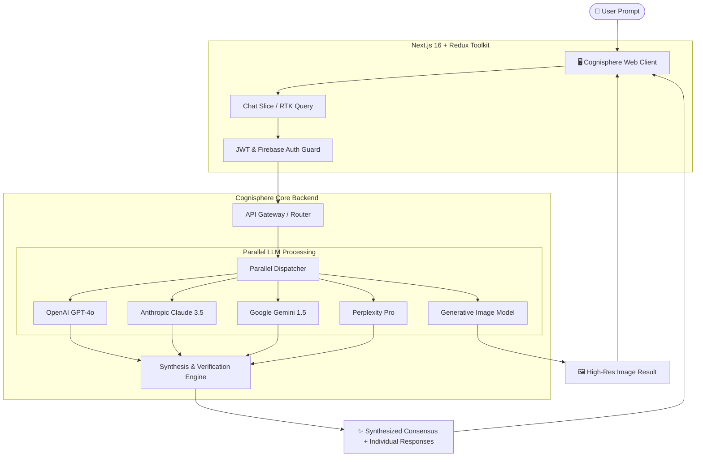

# 🌌 Cognisphere — Unified Multi-Model AI Co-Pilot & Synthesis Platform

<div align="center">



[](https://nextjs.org/)
[](https://react.dev/)
[](https://www.typescriptlang.org/)
[](https://tailwindcss.com/)
[](https://redux-toolkit.js.org/)
[](https://firebase.google.com/)
[](./LICENSE)

**Every Perspective. Every AI. One Unified Place.**

*Your AI Co-Pilot that queries every premier foundation model concurrently, performs comparative reasoning, and synthesizes the optimal consensus response.*

[Live Demo](https://sarbeswardas-frontend-tawny.vercel.app/) • [Explore Features](#-key-features) • [Tech Stack](#-technology-stack) • [Getting Started](#-getting-started) • [Architecture](#-system-architecture)

</div>

---

## 📖 Table of Contents

- [Overview](#-overview)
- [Key Features](#-key-features)
- [UI & Visual Showcase](#-ui--visual-showcase)
- [System Architecture & Workflow](#-system-architecture--workflow)
- [Technology Stack](#-technology-stack)
- [Project Structure](#-project-structure)
- [Getting Started](#-getting-started)
- [Environment Variables](#-environment-variables)
- [API & Multi-Model Integration](#-api--multi-model-integration)
- [Roadmap](#-roadmap)
- [Contributing](#-contributing)
- [License](#-license)

---

## 🌟 Overview

Single AI models often suffer from bias, hallucinations, and blind spots. **Cognisphere** solves this by unifying the world's leading artificial intelligence models—including **OpenAI GPT-4o**, **Anthropic Claude 3.5 Sonnet**, **Google Gemini 1.5 Pro**, and **Perplexity**—into a single collaborative interface.

With Cognisphere, users input a prompt once:
1. **Parallel Querying**: The platform dispatches queries across top-tier LLMs simultaneously.
2. **Side-by-Side Comparison**: Review individual model outputs to inspect different reasoning styles, code implementations, or explanations.
3. **Optimized Synthesis**: An intelligent synthesis engine cross-checks and reconciles all model answers to produce a high-accuracy, hallucination-free consensus summary.
4. **AI Image Generation**: Built-in generative image studio for instant text-to-image creation.

---

## ✨ Key Features

### 🧠 Multi-LLM Parallel Execution & Consensus Synthesis
- Query **ChatGPT (OpenAI)**, **Claude (Anthropic)**, **Gemini (Google)**, and **Perplexity** in a single click.
- Automatic synthesis algorithm analyzes nuances, cross-verifies facts, and delivers a consolidated summary.

### 🔀 Side-by-Side Model Comparison
- Switch between models seamlessly using the model adapter tabs.
- Compare speed, accuracy, token depth, and explanation structure side-by-side.

### 🎨 Creative AI Image Generation Studio
- High-fidelity prompt-to-image creation.
- Multiple aspect ratios and resolution profiles.
- Integrated one-click high-resolution downloads.

### 📐 Rich Markdown, Code & LaTeX Math Rendering
- Full GitHub Flavored Markdown (GFM) support.
- LaTeX formula rendering powered by `rehype-katex` and `remark-math` for complex scientific and mathematical proofs.
- One-click copy for prompts, code blocks, and model outputs.

### 🔒 Enterprise Authentication & Security
- Standard Email/Password registration with OTP email verification.
- Password recovery and reset flows.
- Firebase Google OAuth integration for frictionless sign-in.
- Secure JWT authentication with HTTP-safe state persistence.

### 💳 SaaS Subscription & Billing System
- Multi-tier subscription model with Stripe checkout integration.
- Dynamic upgrade prompts, plan status verification, and self-service cancellation.

### ⚡ Cutting-Edge Dark-Mode UI
- Built with **Next.js 16 (App Router)**, **Tailwind CSS v4**, and **Radix UI** primitives.
- Smooth transitions and interactive micro-animations powered by **Framer Motion**.
- Searchable and categorized chat history with session renaming and deletion.

---

## 🖼️ UI & Visual Showcase

<div align="center">

### 1. Multi-Model AI Comparative Intelligence
*Real-time side-by-side benchmarking and output inspection across leading LLMs.*


---

### 2. Unified Synthesis & Reasoning Engine
*Cross-model consensus algorithm synthesizing multiple responses into maximum accuracy.*


---

### 3. Sleek AI Workspace Dashboard
*Interactive dark-mode workspace with chat history, session switcher, and synthesis view.*


---

### 4. AI Image Generation Studio
*Prompt-based generative studio with aspect ratios, resolution selector, and instant downloads.*


</div>

---

## 🏗️ System Architecture & Workflow



---

## 💻 Technology Stack

| Layer | Technologies |
|---|---|
| **Framework** | [Next.js 16](https://nextjs.org/) (App Router), [React 18.3.1](https://react.dev/) |
| **Language** | [TypeScript 5](https://www.typescriptlang.org/) |
| **Styling** | [Tailwind CSS v4](https://tailwindcss.com/), [tw-animate-css](https://github.com/marceloprado/tw-animate-css) |
| **UI Components** | [Radix UI](https://www.radix-ui.com/), [Lucide React](https://lucide.dev/), [Tabler Icons](https://tabler.io/icons) |
| **Animations** | [Framer Motion 12](https://www.framer.com/motion/) |
| **State Management** | [Redux Toolkit](https://redux-toolkit.js.org/), [RTK Query](https://redux-toolkit.js.org/rtk-query/overview), [Redux Persist](https://github.com/rt2zz/redux-persist) |
| **Authentication** | [Firebase 12](https://firebase.google.com/) (Google OAuth), JWT, Custom Session Cookies |
| **Markdown & Math** | [react-markdown](https://github.com/remarkjs/react-markdown), [KaTeX](https://katex.org/), [rehype-katex](https://github.com/remarkjs/rehype-katex), [remark-gfm](https://github.com/remarkjs/remark-gfm), [remark-math](https://github.com/remarkjs/remark-math) |
| **Visualizations** | [Recharts](https://recharts.org/) |
| **Forms & Validation** | [React Hook Form](https://react-hook-form.com/), [Zod](https://zod.dev/) |
| **Notifications** | [React Toastify](https://fkhadra.github.io/react-toastify/), [Sonner](https://sonner.emilkowal.ski/) |

---

## 📁 Project Structure

```text
sarbeswardas-frontend/
├── public/
│   ├── images/              # Logos, UI previews, and hero graphics
│   │   ├── preview-hero.jpg
│   │   ├── preview-dashboard.jpg
│   │   ├── preview-comparison.jpg
│   │   ├── preview-synthesis.jpg
│   │   └── preview-image-gen.jpg
│   └── final-logo.png
├── src/
│   ├── app/
│   │   ├── (auth)/          # Authentication routes (login, register, OTP, reset)
│   │   ├── (dashboard)/     # Main protected chat workspace & dashboard
│   │   ├── (paymnet)/       # Stripe checkout success & cancel routes
│   │   ├── faq/             # Frequently Asked Questions page
│   │   ├── home/            # Marketing landing page with interactive hero
│   │   ├── layout.tsx       # Root layout with font and Redux providers
│   │   └── page.tsx         # Root redirector
│   ├── components/
│   │   ├── common/          # Atomic reusable inputs, buttons, wrappers
│   │   ├── reuseable/       # AI model tabs, typing loaders, dashboard cards
│   │   ├── ui/              # Radix UI primitives (dialog, dropdown, sidebar, etc.)
│   │   ├── app-sidebar.tsx  # Dynamic collapsible sidebar with chat history
│   │   ├── ChatInput.tsx    # Multi-mode prompt entry input
│   │   ├── ChatMessages.tsx # Thread view with Markdown, KaTeX & side-by-side tabs
│   │   └── ContentPage.tsx  # Primary workspace controller
│   ├── firebase/
│   │   └── firebase.ts      # Client Firebase app & OAuth setup
│   ├── hooks/               # Custom React hooks (useMobile, etc.)
│   ├── lib/                 # MarkdownRenderer, LaTeX utils, helper functions
│   └── store/               # Redux Toolkit store, RTK Query API slices
│       ├── api/             # AIApi, authApi, profileApi, chatSlice
│       ├── Providers.tsx    # Redux Provider wrapper
│       └── store.ts         # Redux store & persist configuration
├── next.config.ts           # Next.js compiler & domain configuration
├── package.json             # Dependencies and build scripts
├── tsconfig.json            # TypeScript configuration
└── README.md                # Project documentation
```

---

## 🚀 Getting Started

### Prerequisites

- **Node.js**: v20.x or higher
- **npm**, **pnpm**, or **yarn**

### 1. Clone the Repository

```bash
git clone https://github.com/Ramjanict/Barakha.git
cd sarbeswardas-frontend
```

### 2. Install Dependencies

```bash
npm install
```

### 3. Configure Environment Variables

Create a `.env.local` file in the root directory:

```bash
cp .env.example .env.local
```

Populate the required credentials (see [Environment Variables](#-environment-variables)).

### 4. Run the Development Server

```bash
npm run dev
```

Open [http://localhost:3000](http://localhost:3000) in your browser to view the application.

### 5. Build for Production

```bash
npm run build
npm run start
```

---

## 🔑 Environment Variables

Create a `.env.local` file with the following variables:

```env
# Backend API Base URL
NEXT_PUBLIC_API_URL=https://api.cognisphere.us/api/v1

# Firebase Configuration (for Google OAuth & Storage)
NEXT_PUBLIC_FIREBASE_API_KEY=your_firebase_api_key
NEXT_PUBLIC_FIREBASE_AUTH_DOMAIN=your_project.firebaseapp.com
NEXT_PUBLIC_FIREBASE_PROJECT_ID=your_project_id
NEXT_PUBLIC_FIREBASE_STORAGE_BUCKET=your_project.firebasestorage.app
NEXT_PUBLIC_FIREBASE_MESSAGING_SENDER_ID=your_sender_id
NEXT_PUBLIC_FIREBASE_APP_ID=your_app_id
NEXT_PUBLIC_FIREBASE_MEASUREMENT_ID=your_measurement_id
```

---

## 🔌 API & Multi-Model Integration

Cognisphere interfaces with high-performance backend microservices for model execution:

- `POST /ai/send` — Dispatches prompt to parallel LLMs and streams synthesis.
- `POST /ai/generate-image` — Triggers creative text-to-image generation.
- `GET /ai/sessions` — Retrieves chat threads and session histories.
- `GET /ai/session/:sessionId` — Fetches complete thread data with per-model responses.
- `POST /plan/checkout` — Initiates secure Stripe subscription checkout.
- `POST /plan/cancel-subscription` — Manages subscription status.

---

## 🗺️ Roadmap

- [x] Parallel query orchestration across OpenAI, Claude, Gemini, and Perplexity
- [x] Side-by-side comparison tabs and consensus synthesis
- [x] AI Image Generation with direct asset download
- [x] Markdown + LaTeX formula parsing
- [x] Stripe subscription & plan gating
- [ ] Multi-turn conversational memory across models
- [ ] Custom persona and system prompt tailoring
- [ ] Export sessions to PDF, Markdown, and JSON
- [ ] Voice input & audio transcription support

---

## 🤝 Contributing

Contributions, issues, and feature requests are welcome!

1. Fork the repository.
2. Create your branch (`git checkout -b feature/AmazingFeature`).
3. Commit your changes (`git commit -m 'Add some AmazingFeature'`).
4. Push to the branch (`git push origin feature/AmazingFeature`).
5. Open a Pull Request.

---

## 📄 License

This project is licensed under the MIT License — see the [LICENSE](./LICENSE) file for details.

<div align="center">
  <sub>Built with ❤️ by Intellecta Labs LLC</sub>
</div>
